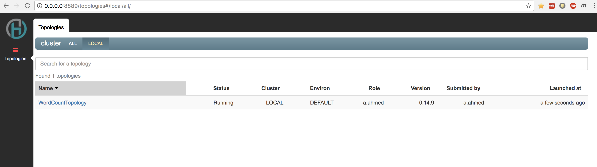
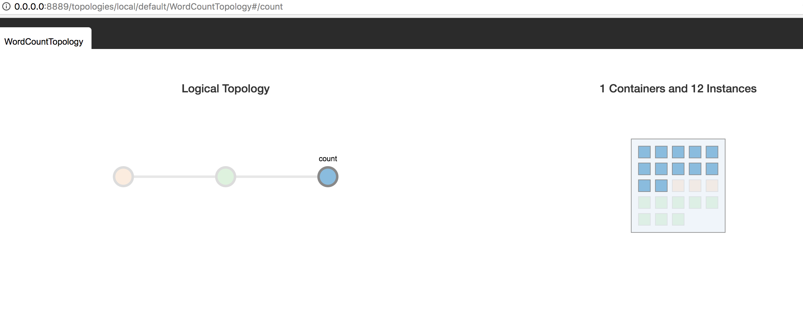
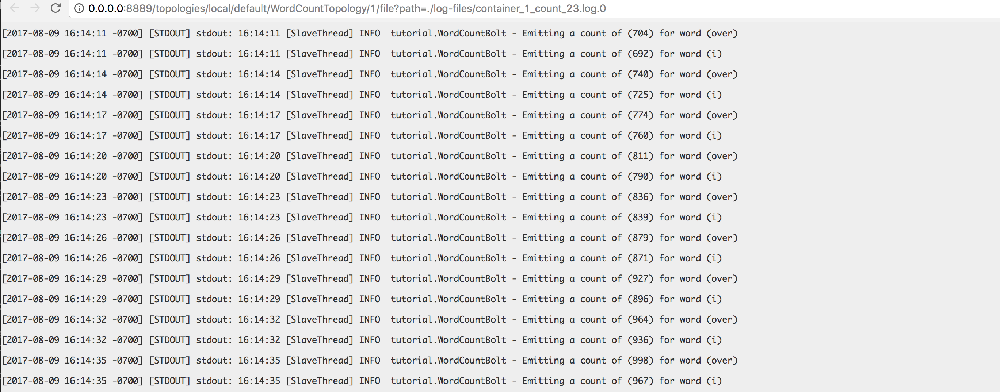

# Creating a Heron topology in Java

In this tutorial, we'll create a [Heron topology](https://twitter.github.io/heron/docs/concepts/topologies/) that implements a word count application. In this application:

* A Heron [spout](https://twitter.github.io/heron/docs/concepts/topologies/#spouts) randomly selects sentences from a list, producing an indefinite stream of sentences
* A Heron [bolt](https://twitter.github.io/heron/docs/concepts/topologies/#bolts) splits the sentences into words
* Another Heron bolt counts the total number of times each word has appeared in the stream

We'll use Maven to build and package the project, start up a Heron cluster locally, and run the topology on the live cluster.

## Prerequisites

* [Java Developer Kit (JDK) version 8](http://www.oracle.com/technetwork/java/javase/downloads/jdk8-downloads-2133151.html)
* [Maven (https://maven.apache.org/download.cgi)](https://maven.apache.org/download.cgi) (a widely used build tool for Java projects)
* A text editor or IDE of your choice

## Clone the project

From the command line, use the following Git command to clone this project:

```bash
$ git clone https://github.com/streamlio/heron-java-tutorial.git
```

This command creates a directory named `heron-java-tutorial` at the current directory, which contains a basic Heron Java project that you can build using Maven. The `heron-java-tutorial` directory contains the following items:

File or directory | Description
:-----------------|:-----------
`pom.xml` | Contains settings for the Maven project
`src/main/java/tutorial` | Contains the application code
`src/main/resources` | Contains the [log4j](https://logging.apache.org/log4j/) logging configuration for the application

## Understanding the Maven `pom.xml` configuration file

### Properties

Maven allows you to define project-level values called *properties* in a `pom.xml` file. Placing the following text after the `<repositories>` section will add two global properties to the configuration:

```xml
<properties>
    <project.build.sourceEncoding>UTF-8</project.build.sourceEncoding>
    <heron.version>0.14.6</heron.version>
</properties>
```

These values are used in different sections of the `pom.xml`. For example, when specifying the version of the Heron libraries, we can use `${heron.version}` instead of hardcoding a value.

### Dependencies

Below are the dependencies for Heron components in the `pom.xml` 

```xml
<dependency>
    <groupId>com.twitter.heron</groupId>
    <artifactId>heron-storm</artifactId>
    <version>${heron.version}</version>
</dependency>
```


### Build configuration

Maven plug-ins allow you to customize the build stages of the project, for example how the project is compiled or how to package it into a JAR file. General POM files follow this convention:

```xml
<build>
    <plugins>
    </plugins>
    <resources>
    </resources>
</build>
```

This section is used to add plug-ins, resources, and other build configuration options. For a full reference for `pom.xml` files, see the [Maven documentation](http://maven.apache.org/pom.html).

### Plug-ins

For Heron topologies implemented in Java, the [Exec Maven Plugin](http://www.mojohaus.org/exec-maven-plugin/) is useful because it allows you to easily run the topology locally in your development environment. The Exec Maven plugin is included in the `<plugins>` section of the `pom.xml` like this:

```xml
<plugin>
    <groupId>org.codehaus.mojo</groupId>
    <artifactId>exec-maven-plugin</artifactId>
    <version>1.4.0</version>
    <executions>
    <execution>
    <goals>
        <goal>exec</goal>
    </goals>
    </execution>
    </executions>
    <configuration>
        <executable>java</executable>
        <includeProjectDependencies>true</includeProjectDependencies>
        <includePluginDependencies>false</includePluginDependencies>
        <classpathScope>compile</classpathScope>
        <mainClass>${heron.topology}</mainClass>
        <cleanupDaemonThreads>false</cleanupDaemonThreads> 
    </configuration>
</plugin>
```

Another useful plug-in is the [Apache Maven Compiler Plugin](http://maven.apache.org/plugins/maven-compiler-plugin/), which is used to change compilation options. This changes the Java version that Maven uses for the source and target for your application.

> For this project we set the source and target Java version to **1.8**.

The compiler configuration is in the `<plugins>` section of the `pom.xml`. To use Java 8:
__Note__ : Java 1.8+ is required for current versions of heron, the example will not work with Java 1.7 or less 

```xml
<plugin>
    <groupId>org.apache.maven.plugins</groupId>
    <artifactId>maven-compiler-plugin</artifactId>
    <version>3.6.2</version>
    <configuration>
        <source>1.8</source>
        <target>1.8</target>
    </configuration>
</plugin>
```

## Create the topology

A Java-based [Apache Storm](http://storm.apache.org/) topology consists of three components that you must author (or reference) as a dependency:

* **Spouts** read data from external sources and emits streams of data into the topology

* **Bolts** perform processing on streams emitted by spouts or other bolts, and emits one or more streams

* The **topology** defines how the spouts and bolts are arranged, and provides the entry point for the topology

> Wait a second: aren't we using *Heron* here and not Storm? Well, it's a bit complicated. Heron is a successor to Storm that can nonetheless run topologies written for Storm (it just runs them more efficiently).

### Create the spout

First, we need to create a data [*spout*](https://twitter.github.io/heron/docs/concepts/topologies/#spouts) for our topology that produces data to be processed.

> Spouts can ingest data from all kinds of sources, from "Big Data" systems like [Apache Spark](https://spark.apache.org/) to pub-sub messaging systems like [Apache Kafka](https://kafka.apache.org) and [Apache Pulsar](https://pulsar.incubator.apache.org). We'll keep it simple here and build a self-generating stream of data.

The random sentence spout is implemented in [`RandomSentenceSpout.java`](src/main/java/tutorial/RandomSentenceSpout.java):

```java
package tutorial;

import ...

/**
 * This spout randomly emits sentences
 */
public class RandomSentenceSpout extends BaseRichSpout {
    // Collector used to emit output
    SpoutOutputCollector collector;

    // Used to generate a random number
    Random rand;

    // Open is called when an instance of the class is created
    @Override
    public void open(Map map, TopologyContext topologyContext, SpoutOutputCollector collector) {
        // Set the instance collector to the one passed in
        this.collector = collector;

        // For randomness
        this.rand = new Random();

    }

    //Emit data to the stream
    @Override
    public void nextTuple() {
        // Sleep for a bit
        Utils.sleep(50);

        // The sentences that are randomly emitted
        String[] sentences = new String[]{
            "the cow jumped over the moon",
            "an apple a day keeps the doctor away",
            "four score and seven years ago",
            "snow white and the seven dwarfs",
            "i am at two with nature"
        };

        // Randomly pick a sentence
        String sentence = sentences[rand.nextInt(sentences.length)];

        // Emit the sentence
        collector.emit(new Values(sentence));
    }

    // Declare the output fields. In this case, an sentence
    @Override
    public void declareOutputFields(OutputFieldsDeclarer declarer) {
        declarer.declare(new Fields("sentence"));
    }

}
```

> Although this topology uses only one spout, other topologies may have several that feed data from different sources into the topology. The number of spouts you need depends on your application and use case.

### Create the bolts

[*Bolts*](https://twitter.github.io/heron/docs/concepts/topologies/#bolts) handle data processing in Heron topologies. Bolts can do essentially anything you want them to, including performing computations, writing values to databases, publishing messages to pub-sub systems, and more.

Our word count topology uses two bolts:

* The `SplitSentenceBolt` splits the sentences emitted by the `RandomSentenceSpout` into individual words

* The `WordCountBolt` receives groups of words from the `SplitSentenceBolt` and counts how many times each word has occurred

These bolts are implemented in [`SplitSentenceBolt.java`](src/main/java/tutorial/SplitSentenceBolt.java) and [`WordCountBolt.java`](src/main/java/tutorial/WordCountBolt.java). You can check out the code by following those links or read more below.

#### `SplitSentenceBolt`

```java
package tutorial;

import ...

/**
 * This Bolt splits a sentence into words
 */
public class SplitSentenceBolt extends BaseBasicBolt {

    // Execute is called to process tuples
    @Override
    public void execute(Tuple tuple, BasicOutputCollector collector) {
        // Get the sentence content from the tuple
        String sentence = tuple.getString(0);

        // An iterator to get each word
        BreakIterator boundary = BreakIterator.getWordInstance();

        // Give the iterator the sentence
        boundary.setText(sentence);

        // Find the beginning first word
        int start = boundary.first();

        // Iterate over each word and emit it to the output stream
        for (int end = boundary.next(); end != BreakIterator.DONE; start = end, end = boundary.next()) {
            // Get the word
            String word = sentence.substring(start, end);

            // If a word is whitespace characters, replace it with empty
            word = word.replaceAll("\\s+", "");

            // If it's an actual word, emit it
            if (!word.equals("")) {
                collector.emit(new Values(word));
            }
        }
    }

    // Declare that emitted tuples contain a word field
    @Override
    public void declareOutputFields(OutputFieldsDeclarer declarer) {
        declarer.declare(new Fields("word"));
    }
}
```

#### `WordCountBolt`

```java
package tutorial;

import ...

/**
 * This Bolt emits word count pairs in periodic intervals
 */
public class WordCountBolt extends BaseBasicBolt {
    // Create logger for this class
    private static final Logger logger = LogManager.getLogger(WordCountBolt.class);

    private static final int EMIT_FREQUENCY = 3;

    // For holding words and counts
    private Map<String, Integer> counts = new HashMap<>();

    // How often to emit a count of words
    private Integer emitFrequency;

    public WordCountBolt(){
        emitFrequency = EMIT_FREQUENCY;
    }

    public WordCountBolt(int emitFrequency){
        this.emitFrequency = emitFrequency;
    }

    // Configure frequency of tick tuples for this bolt
    // This delivers a 'tick' tuple on a specific interval,
    // which is used to trigger certain actions
    @Override
    public Map<String, Object> getComponentConfiguration() {
        Config conf = new Config();
        conf.put(Config.TOPOLOGY_TICK_TUPLE_FREQ_SECS, emitFrequency);
        return conf;
    }

    // Execute is called to process tuples
    @Override
    public void execute(Tuple tuple, BasicOutputCollector collector) {
        // If it's a tick tuple, emit all words and counts
        if(TupleHelpers.isTickTuple(tuple)) {
            for(String word : counts.keySet()) {
                Integer count = counts.get(word);
                collector.emit(new Values(word, count));
                logger.info(String.format("Emitting a count of (%d) for word (%s)", count, word));
            }
        } else {
            // Get the word contents from the tuple
            String word = tuple.getString(0);

            // Have we counted any already?
            Integer count = counts.get(word);
            if (count == null)
                count = 0;

            // Increment the count and store it
            count++;
            counts.put(word, count);
        }
    }


    // Declare that this emits a tuple containing two fields; word and count
    @Override
    public void declareOutputFields(OutputFieldsDeclarer declarer) {
        declarer.declare(new Fields("word", "count"));
    }
}
```

### Define the topology

Once you've created the spouts and bolts that you need for your use case, you need to tie everything together into a processing graph known as a topology (technically speaking a *directed acyclic graph*). Topologies define how data flows between the components. The topology level is also where you can provide *parallelism hints* that Heron can use to make hardware and other choices when creating instances of the components within the cluster.

The following image is a basic diagram of the graph of components for our word count topology:

```
+----------------+          +-------------------+             +-------------+      ("A",2)
|                |          |                   |             |             |
| RandomSentence |          |                   |             |             |      ("B",1)
|     Spout      +----------> SentenceSplitter  +------------>+  WordCount  +---->
|                |          |       Bolt        |             |    Bolt     |      ("C",1)
|                |          |                   |             |             |
+----------------+          +-------------------+   ("A")     +-------------+      ("D",2)
                                                    ("D")
         ("A D B C A D")                            ("B")
                                                    ("C")
                                                    ("A")
                                                    ("D")

```


The word count topology is implemented in [`WordCountTopology.java`](src/main/java/tutorial/WordCountTopology.java). You can see the code by following that link or below:

```java
package tutorial;

import ...

/**
 * This is driver as well the topology graph generator
 */
public class WordCountTopology {

    private WordCountTopology() { }

    // Entry point for the topology
    public static void main(String[] args) throws Exception {

        TopologyBuilder builder = new TopologyBuilder();

        // Add the spout, with a name of 'sentence'
        // and parallelism hint of 3 executors
        builder.setSpout("sentence", new RandomSentenceSpout(),3);

        // Add the SplitSentence bolt, with a name of 'split'
        // and parallelism hint of 8 executors
        // shufflegrouping subscribes to the spout, and equally distributes
        // tuples (sentences) across instances of the SplitSentence bolt
        builder.setBolt("split", new SplitSentenceBolt(),8).shuffleGrouping("sentence");

        // Add the counter, with a name of 'count'
        // and parallelism hint of 12 executors
        // fieldsGrouping subscribes to the split bolt, and
        // ensures that the same word is sent to the same instance (group by field 'word')
        builder.setBolt("count", new WordCountBolt(),12).fieldsGrouping("split", new Fields("word"));
        Config conf = new Config();

        // Resource Configs
        com.twitter.heron.api.Config.setComponentRam(conf, "sentence", ByteAmount.fromGigabytes(1));
        com.twitter.heron.api.Config.setComponentRam(conf, "split", ByteAmount.fromGigabytes(1));
        com.twitter.heron.api.Config.setComponentRam(conf, "count", ByteAmount.fromGigabytes(1));
        com.twitter.heron.api.Config.setContainerCpuRequested(conf, 3);

        // Submit the topology
        HelperRunner.runTopology(args, builder.createTopology(), conf);

    }

}
```

### Configure logging

Heron uses Java logging to log information. Topologies can specify their own logging framework. In this example we are using [log4j](http://www.mojohaus.org/exec-maven-plugin/). To use log4j, these dependencies were placed in the `<dependencies>` section of `pom.xml`:

```xml
<dependency>
    <groupId>org.apache.logging.log4j</groupId>
    <artifactId>log4j-api</artifactId>
    <version>2.6.2</version>
</dependency>

<dependency>
    <groupId>org.apache.logging.log4j</groupId>
    <artifactId>log4j-core</artifactId>
    <version>2.6.2</version>
</dependency>
```    

## Test the topology in a simulator

We can use the following command to test the topology in the Heron simulator. The simulator is designed to test topologies in a single process.

```bash
$ mvn compile exec:java -Dheron.topology=tutorial.WordCountTopology -Dexec.args="WordCount Local"
```

> To use the simulator, you do *not* need to have a Heron cluster running.

As it runs, the topology displays startup information. The following text is an example of the word count output:

```
11:56:48 [count_count_2] INFO  tutorial.WordCountBolt - Emitting a count of (152) for word (keeps)
11:56:48 [count_count_1] INFO  tutorial.WordCountBolt - Emitting a count of (161) for word (two)
11:56:48 [count_count_2] INFO  tutorial.WordCountBolt - Emitting a count of (119) for word (years)
11:56:48 [count_count_3] INFO  tutorial.WordCountBolt - Emitting a count of (525) for word (the)
11:56:48 [count_count_3] INFO  tutorial.WordCountBolt - Emitting a count of (119) for word (score)
11:56:48 [count_count_3] INFO  tutorial.WordCountBolt - Emitting a count of (152) for word (away)
11:56:48 [count_count_3] INFO  tutorial.WordCountBolt - Emitting a count of (125) for word (snow)
11:56:48 [count_count_3] INFO  tutorial.WordCountBolt - Emitting a count of (152) for word (day)
11:56:48 [count_count_3] INFO  tutorial.WordCountBolt - Emitting a count of (125) for word (dwarfs)
```

This example log indicates that the word "keeps" has been emitted 152 times. The count continues to go up as long as the topology runs because the spout continuously emits the same sentences. The output that you see will be different because the sentences are chosen at random.

There is a 3-second interval between emissions of words and counts. The `WordCountBolt` component is configured to only emit information when a tick tuple arrives. It requests that tick tuples are only delivered every five seconds.

## Test on the cluster

In order to test our topology, we need to build a jar that we can deploy on a running Heron cluster. For our example we'll assume that you've set up a single-node Heron cluster running locally. Follow [this simple tutorial](https://twitter.github.io/heron/docs/getting-started/) to get a Heron cluster running in just a few commands.

Once the cluster is up and running, you can package the topology using the configuration that's already in `pom.xml` and then submit the topology to the Heron cluster:

```shell
$ mvn package

$ heron submit local \
  ./target/heron-starter-0.0.1-SNAPSHOT-jar-with-dependencies.jar \
  tutorial.WordCountTopology \
  WordCountTopology Cluster \
  --deploy-deactivated
```

### Command explanation

There was a lot going on in that last command. We'll break it down a bit here:

```shell
$ mvn package # This will build the jar with its dependencies bundled

$ heron submit local \ # Submit to the local cluster
  ./target/heron-starter-0.0.1-SNAPSHOT-jar-with-dependencies.jar \ # The path of the topology's jar file
  tutorial.WordCountTopology \ # The topology's Java class
  WordCountTopology Cluster \ # The name of the topology (must be unique in a cluster)
  --deploy-deactivated # Deploy in deactivated mode
```

### Activating the topology

At this point, the topology has been *submitted* to the Heron cluster but not yet *activated*. That essentially means that Heron has your application code and knows how to run it but hasn't actually started any processes yet. To activate---or run---the topology:

```shell
$ heron activate local WordCountTopology
```

### Visually examining cluster execution

To interact with our word count topology visually, we can use a dashboard interface called Heron UI. To see how to start up Heron UI, see step 4 in [this tutorial](https://twitter.github.io/heron/docs/getting-started/). Once you've started up the UI you can navigate to http://localhost:8889 and see the word count topology running. It should look like this:



We can now examine the topology by clicking on it:



Clicking on the count bolt will open further details:


We can click on the view button > logs on the count bolt to show the streaming stdout:



### Deactivating the topology

Once you've gone through this tutorial, you can deactivate and kill the topology:

```shell
$ heron deactivate local WordCountTopology
$ heron kill local WordCountTopology 
```

> Deactivating a topology means that the topology is still known to the cluster but not running; killing the topology deletes it from the cluster for good.
